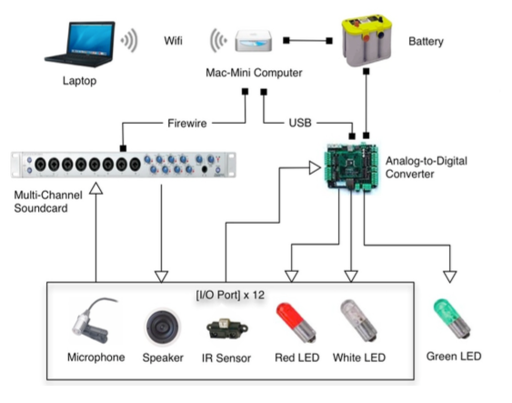
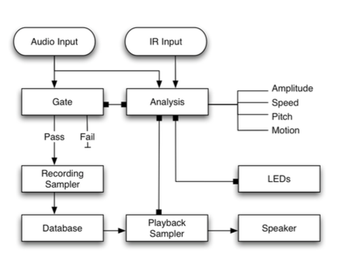

# Documentation

Examples Proposals:

[Giving Tree](https://dl.dropboxusercontent.com/u/57158100/The%20Giving%20Tree%20-%20Burning%20Man%202007%20%28sans%20budget%29.pdf)

[Subway](https://dl.dropboxusercontent.com/u/57158100/Subway%20-%20Burning%20Man%202010.pdf)

## Elevator Pitch (1 paragraph)
An easily accessible, quick project overview.  What why who where and how in a concise package. Think of this as your introductary blog post.

## Philosophical Statement (1-2 paragraphs)
Provide a brief statement about what the art means to you and what you wish to communicate to participants.

## Physical Description (300-500 words)
Share a brief physical description of the installation proposed -- what it looks like when a participant approaches it.  Note color size, signage materials  

## Rendering Sketches (2-3 images)
Start with very quick rough drafts and evolve from there

## Budget
Research your costs carefully and be as specific as possible

## Technical Overview
Description of the artworks’ size, materials, construction methods, lighting, sound, electronics, etc. If applying for support for a program, describe the programs activities, goals and outcomes.

####Flow Charts & Material Lists
* Hardware
Example:

* Software
Example:

## Workplan
| Start Date | End Date | Phase | Task | Category | Estimated Hrs | Resources Needed | Notes |
|------------|----------|-------|------|----------|---------------|------------------|-------|
||||||||||

#### Categories
* Research
* Conceptual Development
* Infrastructure
* Design
* Software Development
* Software Prototyping
* Physical Prototyping
* Testing
* Implementation
* Maintenance
